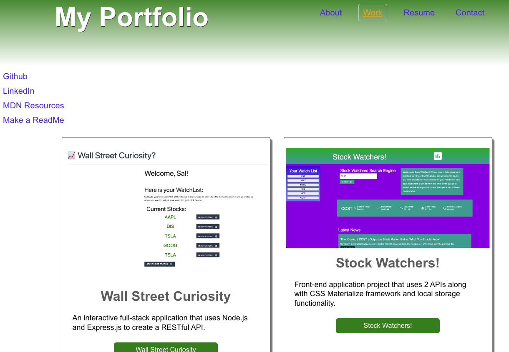

# React Portfolio Project
This codebase contains a deployed React portfolio of my recent work samples for both front and back-end applications.

---

## Getting Started 

* This project was bootstrapped with [Create React App](https://github.com/facebook/create-react-app).

* To run the application:

In the project directory, you can run:

### `npm start`

Open [http://localhost:3000](http://localhost:3000) to view it in your browser.

To learn React, check out the [React documentation](https://reactjs.org/).

---

## Deployed Application 
[Link to deployed application](https://jsalazar99.github.io/react-portfolio)

---

## Application screenshot 

